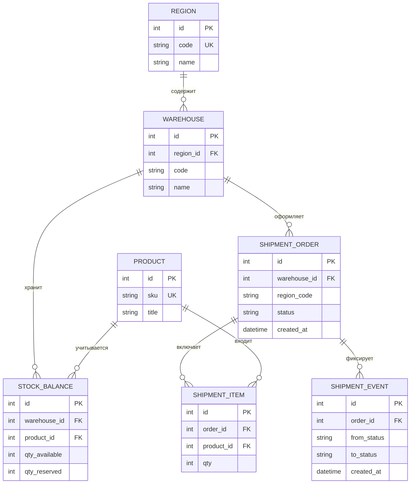
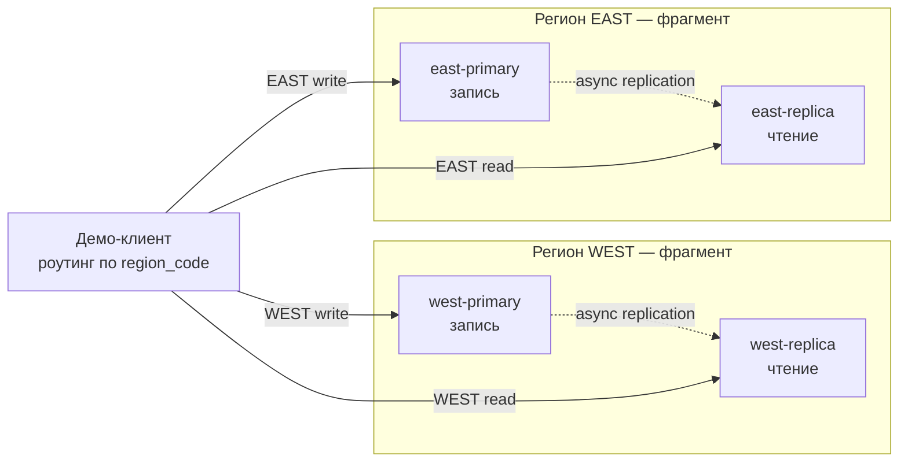

# Описание индивидуального проекта

**Дисциплина:** Распределённые и облачные базы данных  
**Студент:** Ермаков Лаврентий  
**Группа:** М09-КИИ26  
**Дата:** 15.09.2026

---

## Тема

**Горизонтально фрагментированная СУБД контура исполнения отгрузок на распределённых складских площадках**

Проект про учёт остатков и отгрузок на складах в разных регионах. Это не интернет-магазин и не «универсальный CRUD»: в центре внимания — работа площадки (что есть на складе, что зарезервировано, что собрали и отправили), а не витрина для покупателя.

---

## О чём проект

На каждой региональной площадке есть склады. На складах хранятся остатки товаров. По заявке на отгрузку товар резервируют, собирают, отправляют и подтверждают доставку. Все эти шаги фиксируются в журнале событий.

В учебном стенде два региона — **WEST** и **EAST**. Данные каждого региона живут на своих узлах PostgreSQL. Площадки имитируются контейнерами Docker.

**Что хранится:**

| Таблица (EN) | По-русски | Смысл |
|-------------|-----------|--------|
| `regions` | регионы | Периметр площадки (`WEST` / `EAST`) |
| `warehouses` | склады | Склад внутри региона |
| `products` | товары | Номенклатура (общий справочник: `sku`, `title`) |
| `stock_balances` | остатки | `qty_available` — доступно; `qty_reserved` — в резерве |
| `shipment_orders` | заявки на отгрузку | Наряд со статусом жизненного цикла + `region_code` |
| `shipment_items` | позиции заявки | Какие товары и в каком количестве (`qty`) |
| `shipment_events` | журнал событий | Смена статуса заявки (`from_status` → `to_status`) |

**Словарь полей:**

| Поле (EN) | Перевод |
|-----------|---------|
| `region_code` | код региона — ключ фрагментации |
| `sku` | артикул (Stock Keeping Unit) |
| `qty_available` / `qty_reserved` | доступно / зарезервировано |
| `status` | статус заявки |
| `primary` / `replica` | узел записи / узел чтения |
| `async streaming` | асинхронная потоковая репликация |

---

## Почему база распределённая

Одной PostgreSQL на всё недостаточно по смыслу задачи:

1. **Данные привязаны к площадке.** Остатки и заявки региона WEST не должны лежать вместе с EAST и тем более меняться «с чужого» узла. Это периметр: оперативка региона остаётся в регионе.
2. **Автономность.** Если канал до другого региона или «центра» пропал, площадка всё равно должна уметь резервировать и отгружать у себя.
3. **Разные роли узлов.** В регионе есть узел записи (primary) и узел чтения (replica). Второй регион — это **другой фрагмент данных**, а не копия «для балансировки».

Именно поэтому критерий — **по региону / площадке** (и режиму доступа: оперативка не покидает периметр), а не «два сервера, чтобы быстрее».

---

## Как данные режутся между узлами

**Правило:** строка оперативных таблиц с `region_code = WEST` существует только на узлах WEST; то же для EAST.

- **Горизонтальная фрагментация** по `region_code`: остатки, заявки, позиции, события.
- **Производная фрагментация:** позиции и события всегда следуют за заявкой своего региона.
- **Репликация внутри региона:** primary → replica (асинхронная потоковая). Replica только читает.
- **Справочник товаров** копируется на оба региона (реплика справочника), это не отдельный «кусок» оперативки.

**Корректность разреза:**

- полнота — вместе WEST + EAST дают весь контур стенда;
- непересечение — одна и та же заявка не лежит в двух регионах;
- восстановимость — глобальную картину можно собрать по фрагментам без смешивания записи между регионами.

**Если узел упал:**

- упал primary региона → запись в этот регион нельзя, чтение можно с replica;
- упал replica → запись на primary продолжается, чтение переключается на primary;
- запрос «сменить статус заявки чужого региона» → **отказ**, даже если другой узел жив.

---

## Что клиент покажет сверх обычного CRUD

CRUD по складам, товарам, остаткам и заявкам будет. Но главное — предметный сценарий отгрузки:

```text
CREATED → RESERVED → PICKING → SHIPPED → DELIVERED
              ↘ CANCELLED
```

1. **RESERVED** — под заявку резервируется остаток (нельзя зарезервировать больше, чем доступно).
2. **PICKING** — сборка со склада.
3. **SHIPPED** — списание резерва / отправка.
4. **DELIVERED** — успешное завершение.
5. Каждая смена статуса пишется в журнал событий.
6. Попытка трогать заявку другого региона — отказ с понятной причиной.
7. В интерфейсе/логе видно: в какой регион ушла операция и на какой узел (primary / replica).

Это как раз те «две–три операции сверх CRUD»: резерв, цепочка статусов с фиксацией контроля, отказ по периметру.

---

## UML структуры данных



Связи — через внешние ключи. Модель в третьей нормальной форме: нет дублирования названия региона в каждой строке остатка, телефоноподобных списков в одной ячейке и т.п.

**Строчная схема:**

```text
Регион 1──<N Склад 1──<N Остаток >N──1 Товар
                 │
                 └──<N Заявка 1──<N Позиция >N──1 Товар
                           │
                           └──<N Событие (смена статуса)
```

---

## UML распределения по узлам



| Узел | Роль | Что хранит | Кто пишет |
|------|------|------------|-----------|
| west-primary | писатель | оперативка WEST | клиент |
| west-replica | читатель | реплика WEST | никто |
| east-primary | писатель | оперативка EAST | клиент |
| east-replica | читатель | реплика EAST | никто |

Техника: Docker Compose, четыре процесса PostgreSQL, асинхронная потоковая репликация внутри региона, маршрутизация клиента по `region_code`.

---

## Что будет сделано

1. Схема БД (3НФ + FK) и наполнение тестовыми данными.  
2. Стенд из четырёх узлов PostgreSQL (2 региона × primary + replica).  
3. Клиент с CRUD, цепочкой статусов отгрузки и демонстрацией отказа узла / отказа по периметру.  
4. Отчёт: описание, UML, схема распределения, сценарий демо, скриншоты.

Реализация: каталог `Индивидуальный_проект/`.
