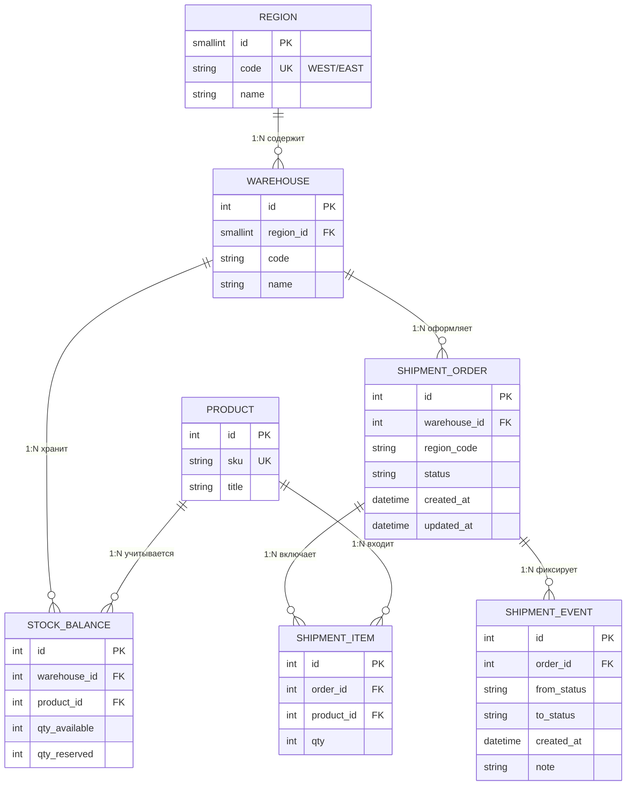
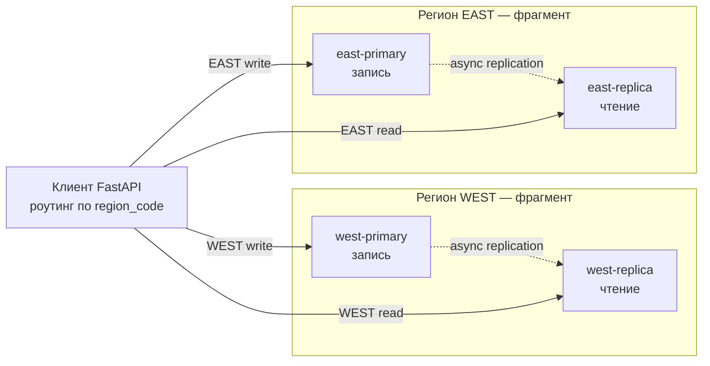

# Индивидуальный проект РБД — понятное описание

**Студент:** Ермаков Лаврентий · группа М09-КИИ26  
**Папка проекта:** `Индивидуальный_проект/`  
**Тема:** «Горизонтально фрагментированная СУБД контура исполнения отгрузок на распределённых складских площадках»

Этот файл — «для себя»: что за проект, как устроены таблицы, почему база распределённая, как всё запускать.  
Диаграммы ниже — **ER** (Entity–Relationship), их можно смотреть прямо в Cursor / GitHub Preview.

---

## 1. О чём проект простыми словами

Представь два региональных склада: **WEST** и **EAST**.

На каждом складе есть товары и остатки. Когда нужна отгрузка:

1. создают **заявку**;
2. **резервируют** товар (чтобы его не отдали другому);
3. **собирают** (picking);
4. **отправляют** (shipped);
5. **подтверждают доставку** (delivered).

Каждый шаг пишется в **журнал событий**.

Важно: это **не интернет-магазин**. Здесь нет «корзины покупателя».  
Это **операционный контур склада**: остатки, резерв, сборка, отгрузка.

Данные региона WEST живут на своих серверах PostgreSQL, EAST — на своих.  
Чужой регион трогать нельзя — это **периметр площадки**.

---

## 2. Тема и критерий распределения

| Вопрос | Ответ |
|--------|--------|
| Почему не одна БД? | Оперативка региона не должна смешиваться с чужим регионом |
| Критерий | По контуру / площадке (`region_code`) + режим доступа |
| Что режется | `stock_balances`, `shipment_orders`, `shipment_items`, `shipment_events` |
| Как режется | **Горизонтальная** фрагментация: строки WEST только на узлах WEST |
| Реплики | Внутри региона: primary (пишет) → replica (только читает), async |
| Справочник | `products` копируется на оба региона (реплика справочника) |

**Не критерий:** «два сервера, чтобы быстрее / балансировка».

---

## 3. Словарь английских имён (таблицы и поля)

### 3.1. Таблицы

| EN (в SQL) | По-русски | Зачем нужна |
|------------|-----------|-------------|
| `regions` | регионы | Периметр: WEST / EAST |
| `warehouses` | склады | Склад внутри региона |
| `products` | товары | Номенклатура (sku, название) |
| `stock_balances` | остатки | Сколько доступно и сколько в резерве |
| `shipment_orders` | заявки на отгрузку | Наряд со статусом жизненного цикла |
| `shipment_items` | позиции заявки | Какие товары и сколько штук |
| `shipment_events` | журнал событий | История смен статусов |

### 3.2. Важные поля

| EN | Перевод |
|----|---------|
| `id` | первичный ключ строки |
| `region_code` | код региона — **ключ фрагментации** |
| `sku` | артикул товара (Stock Keeping Unit) |
| `qty_available` | доступно к резерву / отгрузке |
| `qty_reserved` | уже зарезервировано под заявки |
| `status` | статус заявки |
| `from_status` / `to_status` | было → стало (в журнале) |
| `primary` | узел **записи** |
| `replica` | узел **чтения** (копия) |
| `async streaming` | асинхронная потоковая репликация WAL |

### 3.3. Статусы заявки

```text
CREATED  →  RESERVED  →  PICKING  →  SHIPPED  →  DELIVERED
                ↘ CANCELLED (из CREATED или RESERVED)
```

| EN | По-русски | Что происходит с остатком |
|----|-----------|---------------------------|
| `CREATED` | создана | пока ничего |
| `RESERVED` | зарезервирована | `qty_available−`, `qty_reserved+` |
| `PICKING` | сборка | резерв держится |
| `SHIPPED` | отгружена | `qty_reserved−` (товар ушёл) |
| `DELIVERED` | доставлена | конец успеха |
| `CANCELLED` | отменена | если был резерв — вернуть в available |

---

## 4. ER-диаграмма (структура базы)

Связи через **FK** (foreign key). Модель в **3НФ**: нет дублирования названия региона в каждой строке остатка.



### Строчная схема (то же самое одной картинкой в тексте)

```text
Region 1──<N Warehouse 1──<N StockBalance >N──1 Product
                  │
                  └──<N ShipmentOrder 1──<N ShipmentItem >N──1 Product
                              │
                              └──<N ShipmentEvent
```

### Что такое PK / FK / 1:N

- **PK (Primary Key)** — уникальный номер строки в своей таблице (`warehouses.id = 3`).
- **FK (Foreign Key)** — ссылка на PK другой таблицы (`stock_balances.warehouse_id = 3` значит «этот остаток на складе №3»).
- **1:N** — один склад → много остатков; FK лежит на стороне «многих».

---

## 5. Как данные разложены по узлам (фрагменты и реплики)

В стенде **4 PostgreSQL**:

| Узел | Порт на хосте | Роль | Что хранит |
|------|---------------|------|------------|
| `west-primary` | 15432 | писатель WEST | оперативка WEST |
| `west-replica` | 15433 | читатель WEST | копия WEST |
| `east-primary` | 15434 | писатель EAST | оперативка EAST |
| `east-replica` | 15435 | читатель EAST | копия EAST |



### Фрагмент vs реплика

| Объект | Это |
|--------|-----|
| west-primary / east-primary | **фрагмент** оперативных данных своего региона |
| west-replica / east-replica | **реплика** своего фрагмента (только чтение) |
| копия `products` на обоих primary | **реплика справочника**, не отдельный кусок оперативки |

### Корректность разреза

| Условие | Смысл |
|---------|--------|
| Полнота | WEST + EAST = весь стенд |
| Непересечение | заявка WEST не лежит на EAST |
| Восстановимость | по фрагментам можно собрать картину без кросс-шардового JOIN оперативки |

---

## 6. Что делает клиент (сверх обычного CRUD)

Клиент: FastAPI (`client/app/main.py`), порт **8000**, docs: http://127.0.0.1:8000/docs

### CRUD (через API клиента)

| Сущность | Чтение | Создание | Изменение | Удаление |
|----------|--------|----------|-----------|----------|
| Склады `warehouses` | `GET /api/{region}/warehouses` | `POST .../warehouses` | `PUT .../warehouses/{id}` | `DELETE .../warehouses/{id}` |
| Товары `products` | `GET /api/{region}/products` | `POST .../products` | `PUT .../products/{id}` | `DELETE .../products/{id}` |
| Остатки `stock` | `GET /api/{region}/stock` | `POST .../stock` | `PUT .../stock/{id}` | `DELETE .../stock/{id}` |
| Заявки `orders` | `GET /api/{region}/orders` | `POST .../orders` | статус: `POST .../orders/{id}/status` | — |

В каждом ответе блок `routing`: **region**, **role** (`primary`/`replica`), **host**.

Примеры тел:

```json
{"code":"WH-WEST-2","name":"Склад Запад-2"}
```

```json
{"sku":"SKU-400","title":"Кабель 3м"}
```

```json
{"warehouse_id":1,"product_id":1,"qty_available":40}
```

### Предметный сценарий

1. Создать заявку (`CREATED`) + позицию.
2. `RESERVED` — проверить, что хватает `qty_available`.
3. `PICKING` → `SHIPPED` → `DELIVERED`.
4. Каждая смена → строка в `shipment_events`.
5. Заявка EAST с клиента «как будто WEST» → **отказ по критерию контура**.

### Отказы узлов

| Событие | Поведение клиента |
|---------|-------------------|
| `docker stop` primary WEST | запись WEST запрещена; чтение можно с replica |
| упала replica | чтение переключается на primary |
| чужой регион | отказ, даже если другой узел жив |

---

## 7. Структура папки проекта

```text
Индивидуальный_проект/
├── README.md
├── ПОНЯТНОЕ_ОПИСАНИЕ.md           ← этот файл
├── docker-compose.yml             ← 4× postgres:16 (name: rdb_warehouse)
├── db/
│   ├── primary/00_replication.sh  ← роль replicator + slot на primary
│   ├── replica/entrypoint.sh      ← pg_basebackup → standby
│   └── init/
│       ├── 01_schema.sql
│       ├── west/02_seed.sql
│       └── east/02_seed.sql
├── client/
│   ├── requirements.txt
│   └── app/main.py
├── scripts/
│   ├── bootstrap_schema.sh        ← надёжный накат схемы (рекомендуется)
│   ├── bootstrap_schema.py
│   └── demo.sh
└── docs/
    └── Заявка_индивидуальный_проект_РБД.pdf
```

---

## 8. Как запустить всё (рабочий порядок)

Порты: WEST primary `15432`, WEST replica `15433`, EAST primary `15434`, EAST replica `15435`, API `8000`.

### 8.1. Один раз: Docker и зависимости

```bash
# служба Docker (если была ошибка docker.sock)
sudo systemctl start docker
sudo systemctl enable docker

cd ~/Рабочий\ стол/РБД/Индивидуальный_проект

# важно: пустой COMPOSE_PROJECT_NAME ломает compose
unset COMPOSE_PROJECT_NAME

python3 -m venv .venv
source .venv/bin/activate
pip install -r client/requirements.txt
```

### 8.2. Каждый запуск стенда

```bash
cd ~/Рабочий\ стол/РБД/Индивидуальный_проект
unset COMPOSE_PROJECT_NAME
source .venv/bin/activate

# чистый старт (если что-то криво поднялось раньше)
# docker compose down -v

docker compose up -d
docker compose ps
# ждать STATUS = healthy у всех 4 контейнеров (~30–60 с у реплик)
```

Ожидаемые имена: `rdb-west-primary`, `rdb-west-replica`, `rdb-east-primary`, `rdb-east-replica`.

### 8.3. Схема + seed (на primary; реплики подтянут сами)

Рекомендуемый способ:

```bash
chmod +x scripts/bootstrap_schema.sh
./scripts/bootstrap_schema.sh
```

Эквивалент вручную:

```bash
docker exec -i rdb-west-primary psql -U warehouse -d warehouse < db/init/01_schema.sql
docker exec -i rdb-west-primary psql -U warehouse -d warehouse < db/init/west/02_seed.sql
docker exec -i rdb-east-primary psql -U warehouse -d warehouse < db/init/01_schema.sql
docker exec -i rdb-east-primary psql -U warehouse -d warehouse < db/init/east/02_seed.sql
```

Проверка, что реплика видит данные:

```bash
docker exec rdb-west-replica psql -U warehouse -d warehouse -c "SELECT count(*) FROM stock_balances;"
docker exec rdb-east-replica psql -U warehouse -d warehouse -c "SELECT count(*) FROM stock_balances;"
# ожидаемо: 3 и 3
```

### 8.4. Клиент API

```bash
source .venv/bin/activate
uvicorn client.app.main:app --reload --host 127.0.0.1 --port 8000
```

Открыть в браузере:
- http://127.0.0.1:8000/health  
- http://127.0.0.1:8000/docs  

На `/health` все четыре узла должны быть `"ok": true`, у replica — `"in_recovery": true`, у primary — `false`.

Учётка БД только для локального стенда (**в отчёт пароли не писать**).

### 8.5. Остановка

```bash
# остановить API: Ctrl+C в терминале uvicorn
docker compose stop          # контейнеры остановить
# docker compose down -v     # полностью снести + тома (потом снова bootstrap)
```

---

## 9. Как демонстрировать преподавателю

Говорите по сценарию: **критерий → CRUD с routing → цепочка статусов → отказ по периметру → отказ узла**.

Ниже два варианта одних и тех же шагов: **Swagger UI** (удобно на защите) и **curl** (для скриптов/отчёта).

---

### 9A. Демо через интерфейс Swagger (`/docs`)

1. Откройте в браузере: **http://127.0.0.1:8000/docs**  
   Заголовок: **RDB Warehouse Client**.
2. В каждом запросе: раскрыть метод → **Try it out** → заполнить поля → **Execute**.  
3. Смотреть **Response body**: блок `routing` (`region`, `role`, `host`) и `data`.  
4. Код ответа справа: **200** / **403** / **503** — это тоже часть демо.

#### A0. Health — все узлы живы

1. Найдите `GET /health` → **Try it out** → **Execute**.  
2. Покажите: у всех четырёх `"ok": true`.  
3. Primary: `in_recovery=False`, replica: `in_recovery=True`.

#### A0b. CRUD складов и товаров (обязательно по ТЗ)

1. `GET /api/{region}/warehouses` → region=`WEST` → Execute (чтение с replica).  
2. `POST /api/{region}/warehouses` → body `{"code":"WH-WEST-2","name":"Склад Запад-2"}` → Execute (`role=primary`).  
3. `GET /api/{region}/products` → WEST.  
4. `POST /api/{region}/products` → body `{"sku":"SKU-400","title":"Кабель 3м"}`.  
5. При необходимости `PUT`/`DELETE` по id из ответа.

#### A1. Список остатков (чтение → обычно replica)

1. `GET /api/{region}/stock` → **Try it out**.  
2. В поле **region** введите: `WEST`.  
3. **Execute**.  
4. В ответе укажите пальцем на `routing.role` / `routing.host` (часто `replica` и `:15433`).  
5. Повторите с **region** = `EAST` (другой фрагмент, другой host).

#### A2. Создать заявку на отгрузку (запись → primary)

1. `POST /api/{region}/orders` → **Try it out**.  
2. **region**: `WEST`.  
3. В **Request body** вставьте:

```json
{
  "warehouse_id": 1,
  "product_id": 1,
  "qty": 2
}
```

4. **Execute** → код **200**.  
5. Запишите `data.order.id` (например `1`) — дальше это **order_id**.  
6. Покажите `routing.role = primary`, host `:15432`.

#### A3. Цепочка статусов (сценарий сверх CRUD)

Откройте `POST /api/{region}/orders/{order_id}/status`.

Для каждого шага: **region** = `WEST`, **order_id** = ваш id, затем **Execute**.

| № | Request body | Что говорите |
|---|--------------|--------------|
| 1 | `{"to_status":"RESERVED","note":"резерв"}` | резервирование остатка |
| 2 | `{"to_status":"PICKING","note":"сборка"}` | сборка |
| 3 | `{"to_status":"SHIPPED","note":"отгрузка"}` | отправка, списание резерва |
| 4 | `{"to_status":"DELIVERED","note":"доставлено"}` | завершение |

Пример тела для первого перехода (копировать в Swagger):

```json
{
  "to_status": "RESERVED",
  "note": "резерв"
}
```

Потом журнал:

1. `GET /api/{region}/orders/{order_id}/events` → **Try it out**.  
2. **region** = `WEST`, **order_id** = ваш id → **Execute**.  
3. Покажите цепочку `from_status` → `to_status` в `shipment_events`.

Дополнительно можно снова вызвать `GET /api/WEST/stock` и сравнить `qty_available` / `qty_reserved`.

#### A4. Отказ по критерию контура (чужой регион)

1. Тот же `POST /api/{region}/orders/{order_id}/status`.  
2. **region** поставьте **`EAST`**, а **order_id** — id заявки, созданной в **WEST**.  
3. Body, например:

```json
{
  "to_status": "CANCELLED",
  "note": "попытка чужого региона"
}
```

4. **Execute** → ожидаемо **403** и текст про отказ по критерию / другой регион.  
5. Сказать: «Фрагменты не смешиваются: заявку WEST нельзя менять через EAST.»

Альтернатива тем же смыслом: `POST /api/cross-region-denied` → **Try it out** → заполнить `from_region`, `to_region`, `order_id` → **Execute** (тоже демонстрация запрета).

#### A5. Отказ primary (в Swagger + один раз терминал)

1. В терминале: `docker stop rdb-west-primary`  
2. В Swagger снова `POST /api/{region}/orders` с **region**=`WEST` и любым телом заявки → **Execute** → **503** (узел записи недоступен).  
3. `GET /api/{region}/stock` с **WEST** → часто ещё **200** с `role=replica`.  
4. `GET /health` → у WEST primary `"ok": false`, replica может остаться `true`.  
5. Вернуть узел: `docker start rdb-west-primary`, подождать ~10 с, снова **Execute** на запись.

#### Краткая шпаргалка кликов в Swagger

| Цель | Метод в UI | region | Что ввести |
|------|------------|--------|------------|
| Узлы | `GET /health` | — | просто Execute |
| Склады | `GET/POST .../warehouses` | WEST | JSON code/name |
| Товары | `GET/POST .../products` | WEST | JSON sku/title |
| Остатки | `GET/POST .../stock` | WEST или EAST | — |
| Новая заявка | `POST .../orders` | WEST | JSON warehouse/product/qty |
| Смена статуса | `POST .../status` | WEST | order_id + to_status |
| Журнал | `GET .../events` | WEST | order_id |
| Чужой регион | `POST .../status` | **EAST** + id из WEST | to_status |
| Падение узла | stop primary + POST orders | WEST | см. A5 |

---

### 9B. Те же шаги через curl (для отчёта / скриптов)

### Шаг 0. Показать стенд

```bash
docker compose ps
curl -s http://127.0.0.1:8000/health | python3 -m json.tool
```

Сказать: «Два региона-фрагмента WEST/EAST, в каждом primary (запись) и replica (чтение), асинхронная потоковая репликация. Критерий — `region_code`, не балансировка.»

### Шаг 1. CRUD + куда уходит запрос

```bash
# склады и товары
curl -s http://127.0.0.1:8000/api/WEST/warehouses | python3 -m json.tool
curl -s -X POST http://127.0.0.1:8000/api/WEST/warehouses \
  -H 'Content-Type: application/json' \
  -d '{"code":"WH-WEST-2","name":"Склад Запад-2"}' | python3 -m json.tool

curl -s http://127.0.0.1:8000/api/WEST/products | python3 -m json.tool
curl -s -X POST http://127.0.0.1:8000/api/WEST/products \
  -H 'Content-Type: application/json' \
  -d '{"sku":"SKU-400","title":"Кабель 3м"}' | python3 -m json.tool

# чтение остатков WEST → обычно role=replica, host :15433
curl -s http://127.0.0.1:8000/api/WEST/stock | python3 -m json.tool

# чтение EAST
curl -s http://127.0.0.1:8000/api/EAST/stock | python3 -m json.tool
```

В ответе смотреть блок `routing`: `region`, `role`, `host`.

### Шаг 2. Создать заявку (запись на primary)

```bash
curl -s -X POST http://127.0.0.1:8000/api/WEST/orders \
  -H 'Content-Type: application/json' \
  -d '{"warehouse_id":1,"product_id":1,"qty":2}' | python3 -m json.tool
```

Запомнить `data.order.id` (ниже — `$ID`). В `routing.role` должно быть `primary` / порт `15432`.

### Шаг 3. Предметный сценарий сверх CRUD (цепочка статусов)

```bash
ID=1   # подставьте свой id заявки

for S in RESERVED PICKING SHIPPED DELIVERED; do
  echo "=== $S ==="
  curl -s -X POST "http://127.0.0.1:8000/api/WEST/orders/$ID/status" \
    -H 'Content-Type: application/json' \
    -d "{\"to_status\":\"$S\",\"note\":\"demo\"}" | python3 -m json.tool
done

# журнал событий (фиксация контроля)
curl -s "http://127.0.0.1:8000/api/WEST/orders/$ID/events" | python3 -m json.tool
```

Показать: остаток уменьшился/резерв менялся; в `shipment_events` есть переходы.

### Шаг 4. Отказ по критерию контура

Ту же заявку WEST пытаемся трогать через EAST:

```bash
curl -s -X POST "http://127.0.0.1:8000/api/EAST/orders/$ID/status" \
  -H 'Content-Type: application/json' \
  -d '{"to_status":"CANCELLED"}' | python3 -m json.tool
```

Ожидаемо: **403** / отказ по периметру (заявка другого региона).

### Шаг 5. Отказ primary + чтение с replica

```bash
docker stop rdb-west-primary
sleep 2

# запись должна упасть (503)
curl -s -X POST http://127.0.0.1:8000/api/WEST/orders \
  -H 'Content-Type: application/json' \
  -d '{"warehouse_id":1,"product_id":1,"qty":1}' | python3 -m json.tool

# чтение часто ещё живо с replica
curl -s http://127.0.0.1:8000/api/WEST/stock | python3 -m json.tool
curl -s http://127.0.0.1:8000/health | python3 -m json.tool

# вернуть узел
docker start rdb-west-primary
# подождать healthy ~10 с, снова можно писать
```

### Шаг 6. Автодемо одним скриптом

Второй терминал (API уже запущен):

```bash
cd ~/Рабочий\ стол/РБД/Индивидуальный_проект
source .venv/bin/activate
chmod +x scripts/demo.sh
./scripts/demo.sh
```

Скрипт проходит health → CRUD warehouses/products/stock → create order → цепочку статусов → cross-region → stop primary.

Реальные скрины (Swagger + JSON-ответы):

```bash
pip install playwright && playwright install chromium
python scripts/capture_screenshots.py
# PNG → папка screenshots/
```

### Что сказать в конце демо (30 секунд)

1. Данные режутся по **региону площадки**.  
2. Клиент показывает **на какой узел** ушла операция.  
3. Есть сценарий **не только INSERT/SELECT** — жизненный цикл отгрузки + журнал.  
4. При падении primary региона запись стоп, чтение с replica; чужой регион не подменяет фрагмент.

---

## 10. Полезные SQL-запросы (для демо и отчёта)

Как выполнять (подставьте контейнер: `rdb-west-primary`, `rdb-west-replica`, `rdb-east-primary`, `rdb-east-replica`):

```bash
docker exec -it rdb-west-primary psql -U warehouse -d warehouse
# или одной командой:
docker exec rdb-west-primary psql -U warehouse -d warehouse -c "SELECT ..."
```

### 10.1. Роль узла: primary или replica

```sql
SELECT pg_is_in_recovery() AS is_replica;
-- primary  → false
-- replica  → true
```

### 10.2. Репликация на primary (есть ли подписчик)

```sql
SELECT client_addr, state, sync_state, sent_lsn, replay_lsn
FROM pg_stat_replication;
```

На replica:

```sql
SELECT status, received_lsn, latest_end_lsn
FROM pg_stat_wal_receiver;
```

### 10.3. Справочники и остатки

```sql
SELECT * FROM regions;
SELECT * FROM warehouses;
SELECT * FROM products ORDER BY sku;

SELECT
    w.code AS warehouse,
    p.sku,
    p.title,
    sb.qty_available,
    sb.qty_reserved
FROM stock_balances sb
JOIN warehouses w ON w.id = sb.warehouse_id
JOIN products p ON p.id = sb.product_id
ORDER BY w.code, p.sku;
```

### 10.4. Заявки на отгрузку и позиции

```sql
SELECT id, warehouse_id, region_code, status, created_at, updated_at
FROM shipment_orders
ORDER BY id;

SELECT
    o.id AS order_id,
    o.region_code,
    o.status,
    p.sku,
    i.qty
FROM shipment_orders o
JOIN shipment_items i ON i.order_id = o.id
JOIN products p ON p.id = i.product_id
ORDER BY o.id;
```

### 10.5. Журнал событий (цепочка статусов)

```sql
SELECT
    e.id,
    e.order_id,
    e.from_status,
    e.to_status,
    e.created_at,
    e.note
FROM shipment_events e
ORDER BY e.order_id, e.id;

-- по одной заявке
SELECT from_status, to_status, created_at, note
FROM shipment_events
WHERE order_id = 1   -- подставьте свой id
ORDER BY id;
```

### 10.6. Критерий фрагментации: какие region_code на этом узле

```sql
SELECT region_code, count(*) AS orders_cnt
FROM shipment_orders
GROUP BY region_code;

-- На WEST-primary ожидаемо только WEST (или пусто до создания заявок).
-- На EAST-primary — только EAST.
-- Появление чужого region_code на узле = нарушение критерия.
```

### 10.7. Ручной CRUD «как в клиенте» (на своём primary)

```sql
-- создать заявку WEST (выполнять на rdb-west-primary)
INSERT INTO shipment_orders (warehouse_id, region_code, status)
VALUES (1, 'WEST', 'CREATED')
RETURNING *;

INSERT INTO shipment_items (order_id, product_id, qty)
VALUES (1, 1, 2)   -- order_id подставить из RETURNING
RETURNING *;

INSERT INTO shipment_events (order_id, from_status, to_status, note)
VALUES (1, NULL, 'CREATED', 'manual insert');
```

Резерв (упрощённо, без FOR UPDATE как в клиенте):

```sql
BEGIN;

UPDATE stock_balances
SET qty_available = qty_available - 2,
    qty_reserved  = qty_reserved + 2
WHERE warehouse_id = 1 AND product_id = 1
  AND qty_available >= 2;

UPDATE shipment_orders
SET status = 'RESERVED', updated_at = NOW()
WHERE id = 1 AND region_code = 'WEST';

INSERT INTO shipment_events (order_id, from_status, to_status, note)
VALUES (1, 'CREATED', 'RESERVED', 'manual reserve');

COMMIT;
```

Проверка, что на replica то же видно (после небольшой паузы):

```bash
docker exec rdb-west-replica psql -U warehouse -d warehouse -c \
  "SELECT id, status, region_code FROM shipment_orders ORDER BY id;"
```

### 10.8. Показать FK / структуру таблиц

```sql
\dt

SELECT
    tc.table_name,
    kcu.column_name,
    ccu.table_name AS foreign_table,
    ccu.column_name AS foreign_column
FROM information_schema.table_constraints tc
JOIN information_schema.key_column_usage kcu
  ON tc.constraint_name = kcu.constraint_name
JOIN information_schema.constraint_column_usage ccu
  ON ccu.constraint_name = tc.constraint_name
WHERE tc.constraint_type = 'FOREIGN KEY'
ORDER BY tc.table_name;
```

### 10.9. Что показать преподавателю из SQL (минимум)

| Запрос | Зачем |
|--------|--------|
| `pg_is_in_recovery()` на primary и replica | роли узлов |
| `pg_stat_replication` | репликация жива |
| остатки + заявки на WEST и EAST | разные фрагменты |
| `shipment_events` по `order_id` | сценарий сверх CRUD |
| `GROUP BY region_code` | критерий не нарушен |

---

## 11. Что сдавать / что будет в отчёте

1. Описание ТЗ и тема  
2. UML / ER структуры данных  
3. Схема распределения (фрагменты + реплики) + критерий  
4. Техническая реализация стенда (роли, канал, лаг)  
5. Модель отказа узла  
6. Сценарий демо клиента (раздел 9 выше)  
7. Код запросов + скрины CRUD и цепочки статусов (раздел 10)  
8. Электронно: compose, SQL, клиент, зависимости  

Заявка: `docs/Заявка_индивидуальный_проект_РБД.pdf`.

---

## 12. Мини-шпаргалка «зачем каждая таблица»

1. **regions** — список периметров (WEST/EAST).  
2. **warehouses** — физические склады внутри региона.  
3. **products** — общий каталог товаров (одинаковый на шардах).  
4. **stock_balances** — «на этом складе этого товара столько свободно / в резерве».  
5. **shipment_orders** — заявка на отгрузку со статусом и `region_code`.  
6. **shipment_items** — строки заявки (товар + qty).  
7. **shipment_events** — аудит: кто/когда сменил статус (фиксация контроля).

Если помнишь эту семёрку + правило «WEST пишет только в WEST» — ты уже понимаешь проект целиком.
